This page provides an overview for setting up and working in RStudio that will set you up for success in creating a reproducible workflow for data analysis in R.

## What are R and RStudio?
It is important to clearly distinguish between [R](https://www.r-project.org) and [RStudio](https://posit.co/products/open-source/rstudio) because they can easily become intertwined. In short:

- **R** is the programming language
- **RStudio** is the application in which we will write and run R code. It is the integrated developer environment (IDE) most closely associated with R.

It is possible to run R in many different applications and environments. In fact, Posit, the company behind RStudio is currently building a new IDE for data analysis called [Positron](https://positron.posit.co). You can also run R on the command line or in another IDE such as [Visual Studio Code](https://code.visualstudio.com/docs/languages/r).

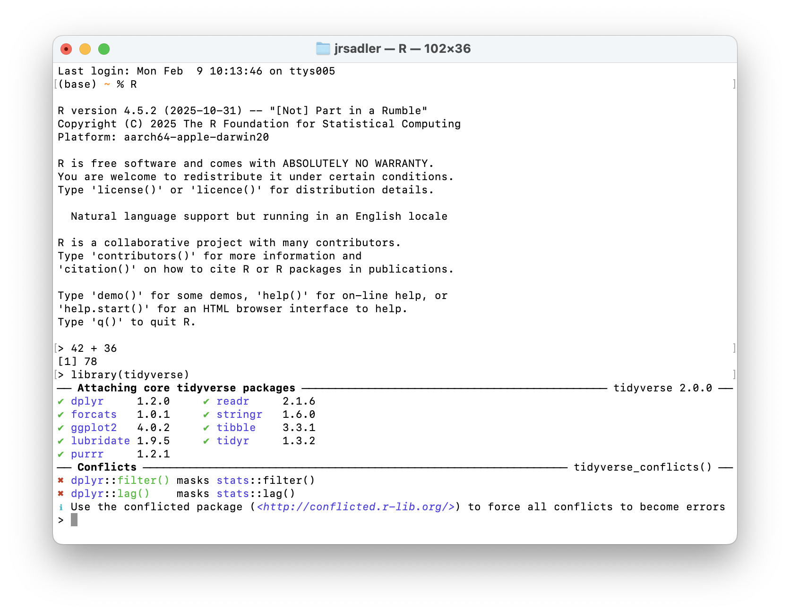{#fig-terminal width=60% fig-alt="A screen shot of R running in the Terminal application."}

RStudio is currently the most widely used way to use R. It is a mature, open source application that provides many features that help people write good R code.

## Install R and RStudio

### Installing R
1. Go to the CRAN (Collective R Archive Network) website: <https://cran.r-project.org/>
2. Click on the link in the first box of text that corresponds to your operating system.
3. Download the latest version of R (currently 4.5.2 as of January 2026).
    - For **macOS**, select the `.pkg` file that corresponds to your processor, likely Apple silicon but possibly Intel if you have an older computer.
    - For **Windows**, select the links from the first line, either `base` or `install R for the first time`. They go to the same place. Then select the `Download R for Windows` link with the latest version of R.
4. Double click on the downloaded file (check your `Downloads` folder). Click Yes through all the prompts to install like any other program.

### Download RStudio
1. Go to the RStudio page on Posit's website: <https://posit.co/download/rstudio-desktop/>
2. Follow step 2: Install RStudio since you have already complete step 1: Install R. Choose your operating system.
3. Select the `Download RStudio for Desktop` button.
4. Install by double clicking on the downloaded file and accept any prompts.
5. Run RStudio to make sure that everything succeeded.

## Navigating RStudio
When you open up RStudio for the first time you will be presented with a three panel view: 

- The left panel is the **console**. This is where you write or send code, run it, and see any output. You type your code after the **prompt**, which in R is `>`.
- The upper-right panel shows any objects you create in your session.
- The bottom-right panel shows your project files but also has tabs to show plots you make, packages you have installed, and a viewer for documentation.

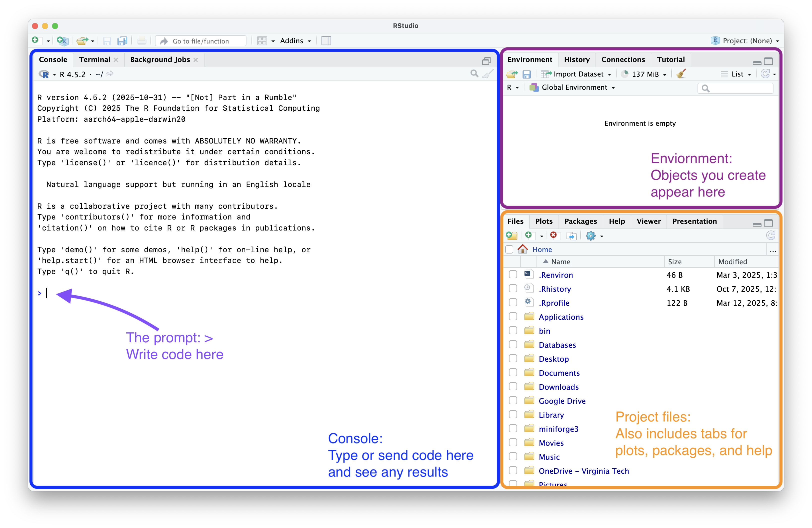{#fig-startup fig-alt="A screen shot of the RStudio application with three panels."}

Type in your first R command to make sure everything is working. Type out a mathematical calculation and press `Return` or `Enter` to run the line of code.

## RStudio projects
One of the foundational features of RStudio is the concept of **projects**. Projects set up your analyses for reproducibility by making it clear where your analysis lives and how your data, scripts, and all other files that belong to an analysis are related to each other. In short, they are all contained in a project folder. Projects are based on R's notion of the **working directory**. This is the folder where R *starts* when you ask it to load data files or save scripts. If this is the first time that you have opened RStudio, your working directory is probably your **home** directory. On macOS this is represented with `~/`, on Windows likely with `C:\Users\[your-username]`. You can see this at the top of the console panel.

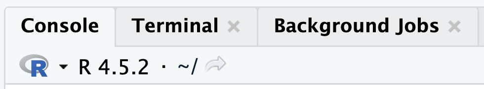{#fig-wd width=40% fig-alt="A screen shot of the top of the console in RStudio that shows the current working directory."}

RStudio projects provide a clear and explicit way to tell R where to start (to set your working directory) and keep all of your analysis together. Let's create our first project. This project will hold all of the code and data we will work on in our in-class sessions. When you want to work on a project with your own data, follow these steps again to create a new project in a different folder.

1. Go to the File menu and select New Project...
2. In the New Project Wizard select New Directory.
3. Choose New Project for the Project type.
    - Other project types provide a template to help you get started with those types of projects.
4. Name your project and choose where to put it.
    - Finally, select **Create Project** 

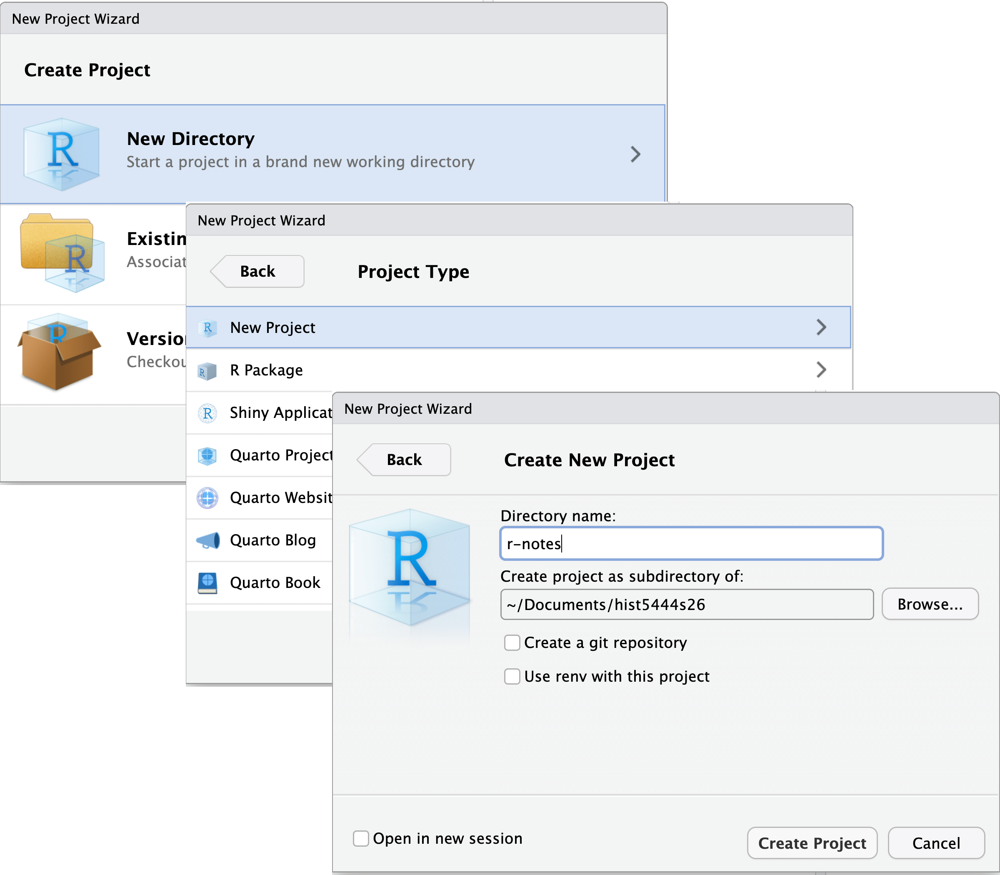{#fig-new-project width=75% fig-alt="A screen shot of the three dialogue windows in the RStudio project wizard interface."}

RStudio will start back up, but now your working directory will be the new project folder you created. You can verify you are in your new project in four different locations in the RStudio interface.

1. The name of the RStudio window will now contain your project name.
2. The top of the console has the **path** on your computer from your *home* to the project folder.
3. The project dropdown on the top-right of the RStudio window. You can use this menu to quickly switch between different projects.
4. The files panel will show the path to your working directory that will now have a single file with the name of your project followed by the extension `.Rproj`.

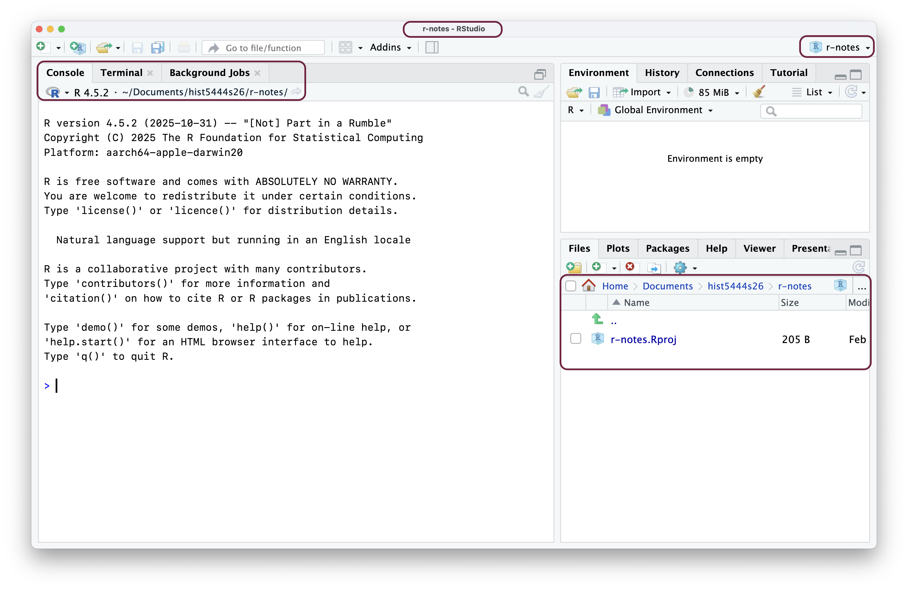{#fig-project fig-alt="A screen shot of the RStudio application with three panels. The four locations where you can see the current project are highlighted in maroon."}

### Setting up your project structure
To make the best start to ensure the project remains organized and reproducible, we can create folders to separate the different kinds of files in the project. Add folders to separate raw data, any modified data we create, the scripts we write, and the figures we make from each other. The most important aspect of this is to separate **raw data** from modified data created using R.[^1] Keeping these two types of data separate will protect you from making errors and possible data loss. You can add the folders in the RStudio files panel by clicking on the folder with the plus sign, or you can create the folders in Finder or File Explorer. Your folders should be named:

- `data/`: Any modified data that you want to store after cleaning or analyzing your raw data.
- `data-raw/`: Raw data that you have created or gotten from an external source.
- `scripts/`: Where you will keep your R scripts and any other documents such as Quarto documents.
- `fig/`: A place to store any visualizations you make in the course of your analysis.
- `README.md`: Lastly you can create a README file to explain the purpose and structure of the project. To create a new Markdown file in RStudio go to File -> New File -> Markdown File.

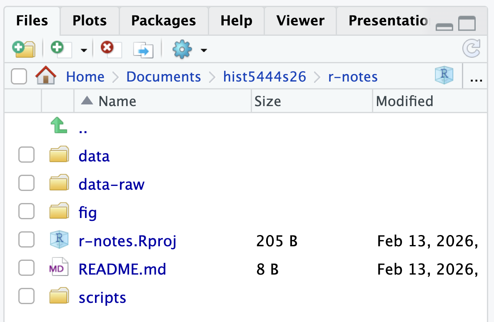{#fig-project-setup width=50% fig-alt="A screen shot of RStudio with the folder structure described above."}

::: {.callout-tip}
## What is the r-notes.Rproj file?
The `.Rproj` file is a plain text file that has a couple of project based settings in it. You can click on it in RStudio and it will open a dialogue window. Generally, you do not want to touch the file. Primarily, the project file is the best target for opening up your project. Double-click on any `.Rproj` file and RStudio will open to that project.
:::

::: {.callout-note}
## Relative vs absolute paths

Projects enable you to access files such as data with **relative paths** from your working directory. For instance, you can access a data file called `SAFI_clean.csv` in the `raw-data` folder using the relative path: `data-raw/SAFI_clean.csv`.

If you did not use projects and kept the working directory as your **home** directory, you would have to use **absolute paths**. Absolute paths point to a file or folder regardless of the working directory. An absolute path on macOS might look like `Users/my_username/Documents/code/my-project/data-raw/SAFI_clean.csv`. This path will only work on your own computer, and it won't work if you decide to move the project folder.

Stick with relative paths. If you give your project folder to someone else and use projects and relative paths, the paths will correctly find the data on their computer.
:::

## The editor panel
Now that you have created a project, you can create your first R script where you will save our code. When you create a new R script or any other type of file, a fourth panel will appear in the upper left and the console will shrink to the bottom-left position. You can create a new R script (this is a text file that ends with the extension `.R`) in many ways.

- Go to File -> New File -> R Script
- Click on the plus sign with the blank paper behind it in the upper-left corner of RStudio and select R Script.
- Similarly, click on the plus sign with the blank paper behind it in the upper-left corner of the Files panel.
- Or with a keyboard shortcut: `Cmd/Ctrl + Shift + N`.

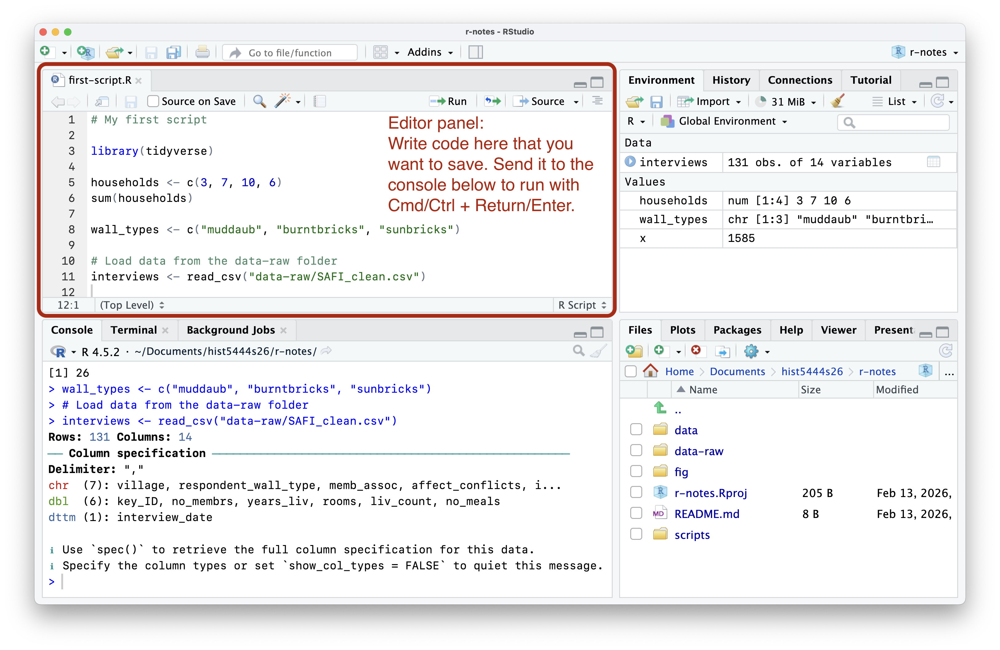{#fig-editor-panel fig-alt="A screen shot of the RStudio application with four panels."}

## The workflow
The basic workflow for RStudio is to write and run code in the left two panels and inspect aspects of what you are doing or what you have created in the right two panels.[^2]

The **console** can be thought of as where the action happens. It is where code is actually run and where any outputs will be shown. (This is known as printing to the console). However, the console is also *ephemeral*. You run code expression by expression, pushing each line of code further and further up into the console's history, out of sight and out of mind. You can look at your history, but, practically speaking, there is no good, clear way to track what you have done just by using the console.

This is where the **editor panel** comes in. The editor panel shows text documents in which you will save the code and any documentation or explanations that you want to keep. The two main types of documents you will work with in RStudio are R scripts and [Quarto documents](quarto-docs.qmd), which are [Markdown documents(markdown-syntax.qmd)] that can also contain blocks of code.

### Scripts and reproducibility
Scripts are at the foundation of reproducibility. They contain the code that performed a certain set of analysis or created a visualization that can be run by you or someone else later. Unlike the console, scripts are meant to be permanent or at least record what you have done. You save scripts, but you do not save what happened in the console.[^3]

An **R script** is a plain text document in which everything that is typed is assumed to be R code that will be sent to the console. To run code from a script (or send it to the console) you cannot just type `Return/Enter`. That moves you to the next line. Instead, place your cursor anywhere within an R expression and press `Cmd + Return` or `Ctrl + Enter`. If you want to write comments in a script to take notes or tell future you or any collaborators why you did something, you need to place a hashtag `#` before it. Anything after `#` will not be run as code.

- Execute an R expression from a script: place cursor within the expression and press `Cmd + Return` or `Ctrl + Enter`
- Comment: `#`

This distinction between *permanent* and *ephemeral* also translates to the panels on the right. The files pane (bottom right) shows the scripts you create and any data or visualization you save. These are permanent. The environment panel (upper right) shows the objects created in a session by running code in the console. These objects are ephemeral. They exist and can be used in this session, but they can always be recreated from the script.

The script trumps the environment panel; it is the source of truth. The code that creates the object is much more important than the object itself. Think of it this way, if you have it right in the environment but wrong in a script, it will not do you much good when you come back to your code after a break and find that things are out of whack.

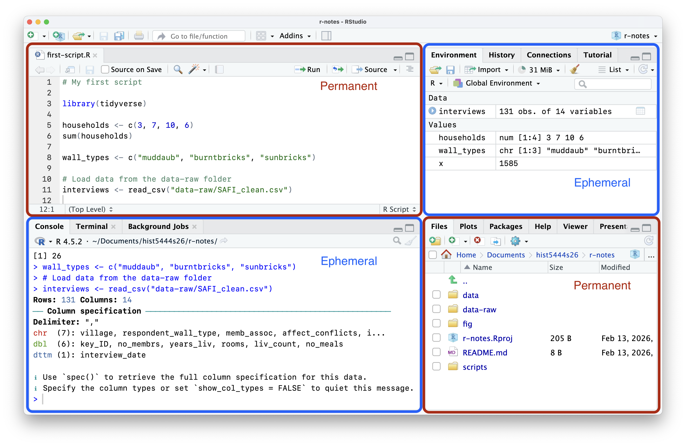{#fig-permanence fig-alt="A screen shot of the RStudio application showing that the editor and file panels are permanent data and the console and environment panels hold ephemeral data."}

## Setting up RStudio for reproducibility
We need to make some important changes to the default settings in RStudio to ensure that R scripts remain the source of truth of your analysis not your environment. Go to Tools -> Global Options and uncheck Restore .RData into workspace at startup and set Save workspace to .RData on exit to `Never`.

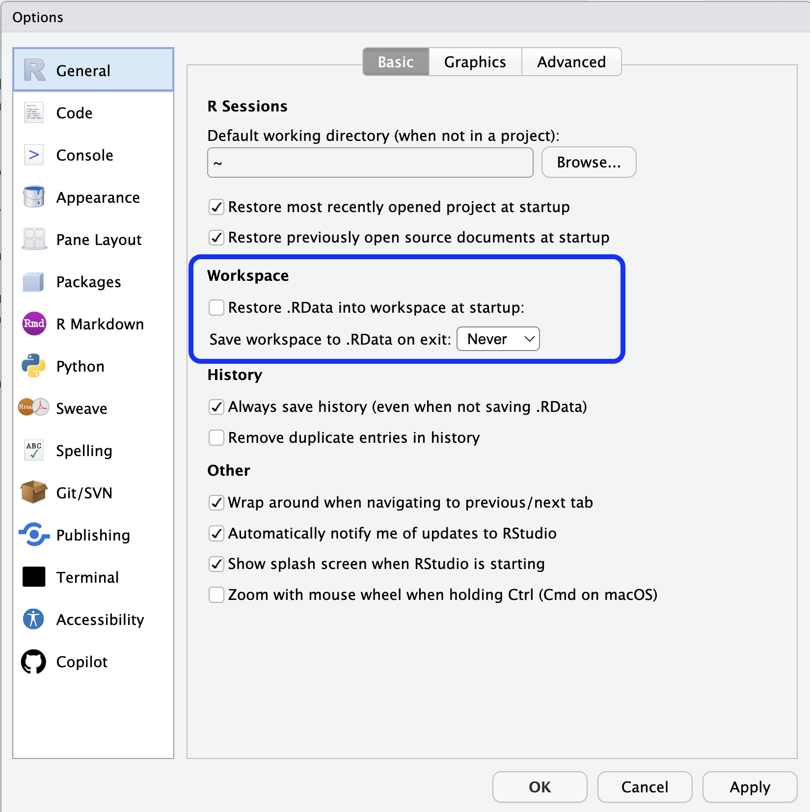{#fig-workspace width=50% fig-alt="A screen shot of the Settings window for RStudio."}

To see what this does, create some objects in your environment using the assignment operator: `x <- 5`. Then, restart your session. You can do this by going to the Session menu -> Restart R. Your environment panel should be empty now. This might seem like it is painful, but it is short-term pain for long-term gain. It will teach you to keep what you want to save in your R script, so that you can always recreate objects or rerun analysis later.

In fact, running `Restart R` and then running your script, either one line at a time (hit `Cmd + Return` or `Ctrl + Enter` over and over) or `Cmd/Ctrl + Shift + S` to re-run the entire script, is a good way to ensure that your script is correct. Better to find out now if there is a problem than weeks or months down the road.

## Packages
After getting RStudio set up, the next step is to install widely used packages. R comes with a preinstalled set of packages known as **base R**. The real power of R comes from combining this strong foundation for data analysis with other packages built by community members. Generally you will install packages through the central package repository called [CRAN (The Comprehensive R Archive Network)](https://cran.r-project.org), which is also where you downloaded R. There are over 23,000 packages on CRAN.[^4]

### Installing packages
A good place to start is with installing the [tidyverse](https://tidyverse.org) set of packages. There are two ways to do this. Either through a function in the console or using the RStudio [GUI (Graphical User Interface)](https://en.wikipedia.org/wiki/Graphical_user_interface).

1. You can install packages with the `install.packages()` function with the names of the packages you want to install in a character vector.

```r
install.packages("tidyverse")
```

2. To use the graphical interface to install packages:
    - Select the Packages tab in the Files panel on the bottom right of RStudio.
    - Click on Install button on the top left of the panel.
    - This will open a popup dialogue. Type in the packages you want to install—in this case `tidyverse`—and then click Install.
    - Note that RStudio will actually run the command `install.packages("tidyverse")` in the console.

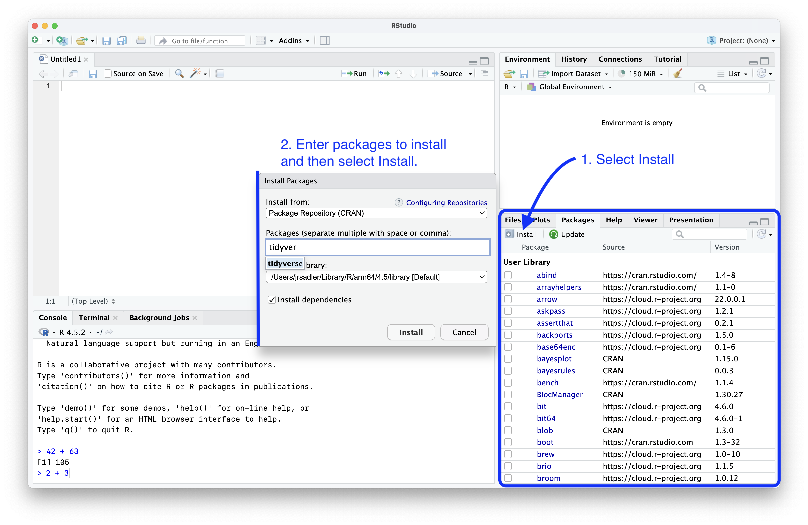{#fig-install-pkgs fig-alt="A screen shot of the RStudio application showing the process to install packages using the GUI interface."}

### Using packages
The tidyverse set of packages is now installed, but to actually use the functions from the package in an R session, you need to load the package. This is done with `library()`.

```r
library(tidyverse)
```

You do not need to put quotation marks around `tidyverse` because the `library()` function knows where to look for something called `tidyverse`. You can put quotation marks around it if you want to. You should get an output in your console that looks like this:

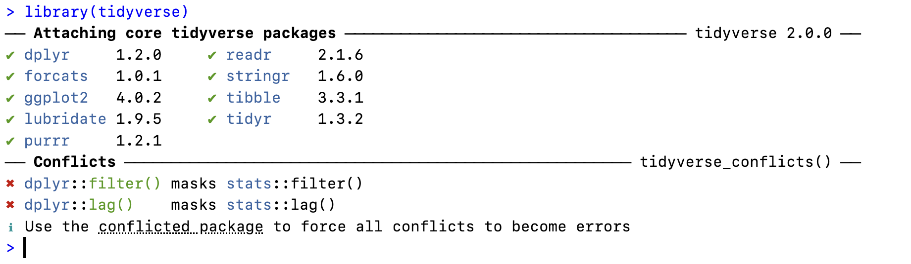{#fig-load-tidyverse width=90% fig-alt="A screen shot of the output from loading the tidyverse, showing the packages loaded and functions that conflict with those from other packages."}

You see a list of the nine core tidyverse packages and their versions: dplyr, forcats, ggplot2, lubridate, purrr, readr, stringr, tibble, tidyr. You will also see a message that there are conflicts. This sounds scary but is expected behavior. This message tells us that dplyr has functions called `filter()` and `lag()`, which are also names for functions in base R. When you use these function after loading the tidyverse, you will use the dplyr version, which is what we want.

Remember, because you set up RStudio for reproducibility, you need to run `library(tidyverse)` every time you begin a new session. Therefore, you should load the packages you will use at the start of your script. Writing `library(tidyverse)` at the top of each script is a good practice to begin with.

### Updating packages
Packages often change, bugs are fixed (and sometimes added) and new features are created, so it is a good idea to update your packages every once in a while.[^5] Again, there is a way to do this in the console and through the Packages panel.

1. Run `update.packages()` and choose `y` to update the packages.
2. To use the graphical interface to update packages:
    - Click on Update button on the top left of the Packages tab of the Files panel. It is right next to Install.
    - You can click the Select All button on the bottom right of the dialogue window that pops up.
    - Then Install Updates.

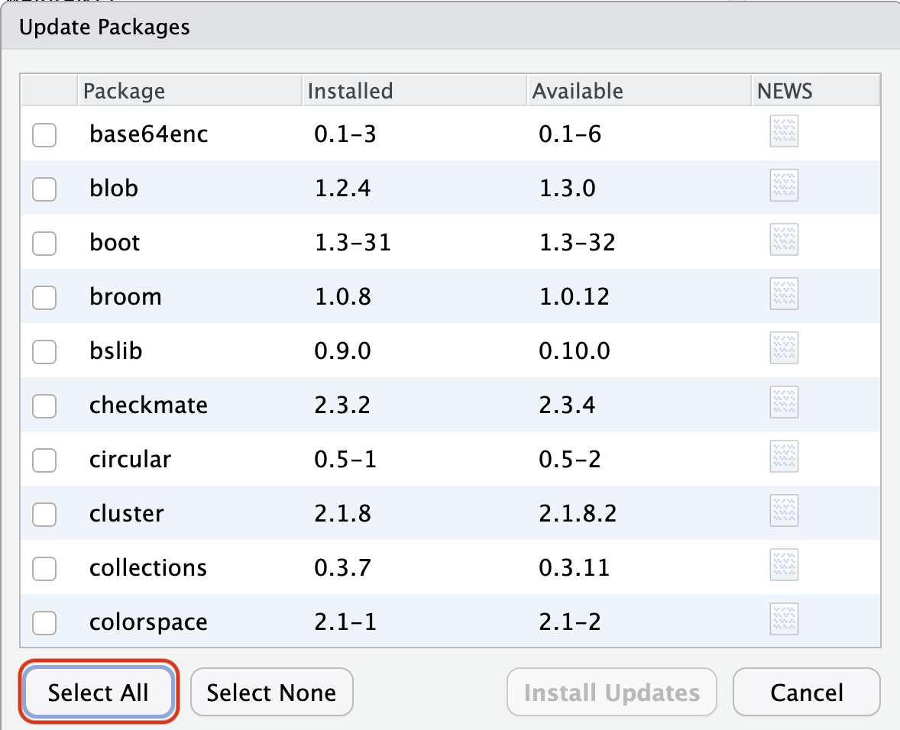{#fig-update-pkgs width=50% fig-alt="A screen shot of the RStudio application showing the process to update packages using the GUI interface. The Select All button is highlighted in red."}

## Other tweaks
There are also a couple of tweaks that you can make to the appearance and way things work in RStudio that might be worth your time. The settings for RStudio are found under Tools -> Global Options. Under the Appearance tab you can change the color theme for RStudio, choose your font and font size.

Another change that you can make is in the R Markdown tab. This changes the settings for notebook-like files such as R Markdown and Quarto. You can uncheck Show output inline for all R Markdown documents. This makes Quarto documents act more like scripts. Instead of printing output below a cell block and in the console, the output only goes to the console.

::: {layout-ncol=2}
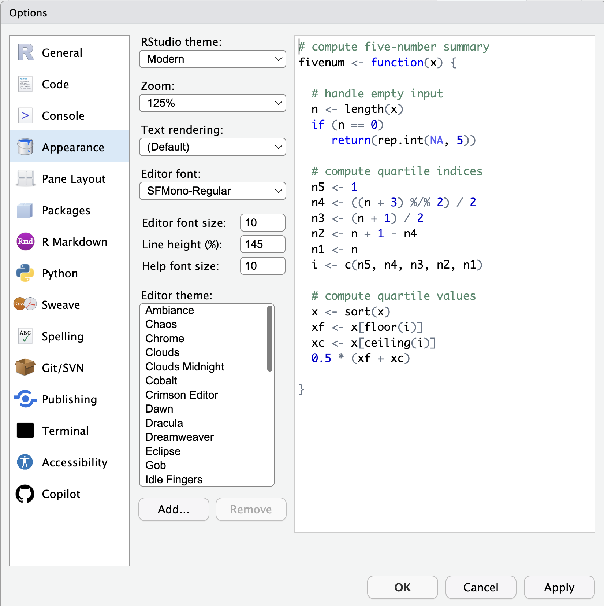{#fig-appearance fig-alt="A screen shot of the RStudio Appearance settings."}

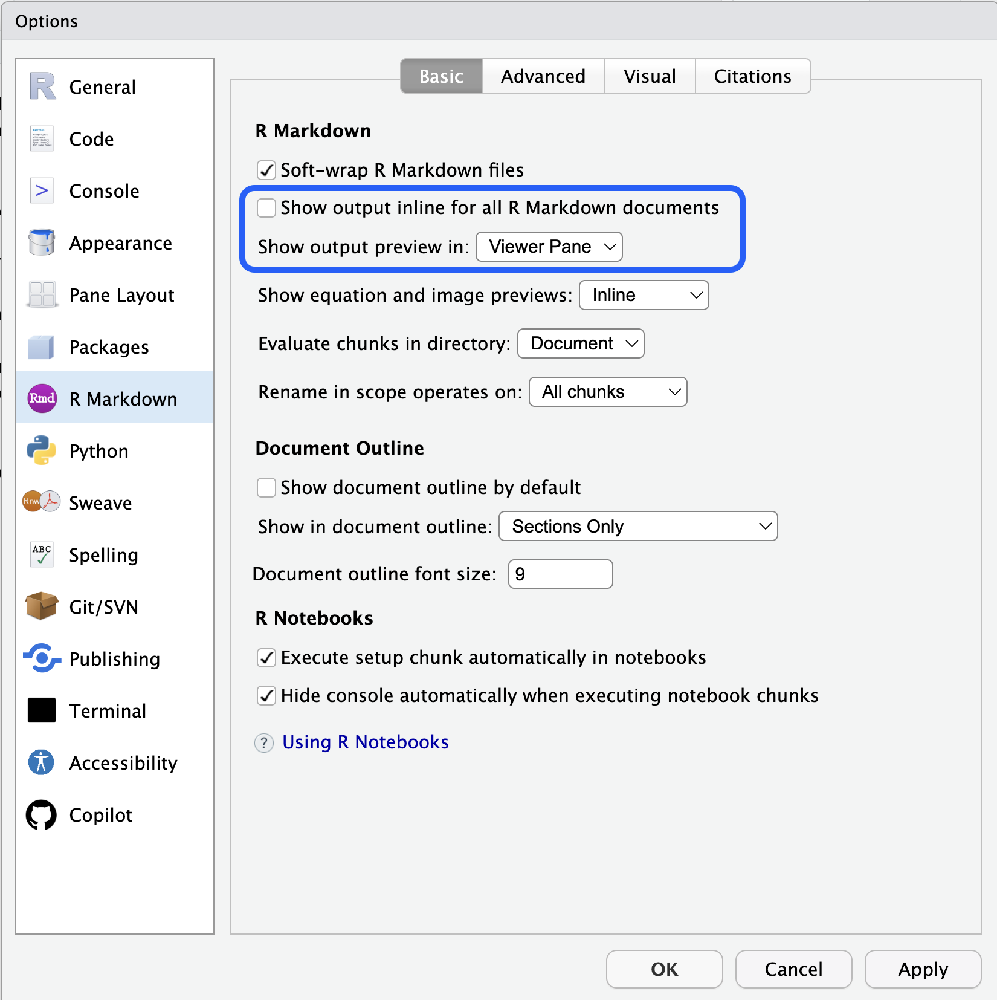{#fig-rmarkdown-settings fig-alt="A screen shot of the RStudio R Markdown settings."}
:::

The **Code** tab has a couple of settings that you might want to change.

- Use the native pipe operator (`|>`) by checking the box.
- Under Display you might want to uncheck Show margin. This will turn off the vertical line in the editor pane.
- At the bottom of Display there is a check box for rainbow parentheses. This turns each set of parentheses a different color, which can help you keep track of where you are in more complex code.

Play around with the themes to make RStudio a nice, fun place to be. You might even look for some different monospaced fonts.[^6]


[^1]: Raw data may be an oxymoron, but it is a useful one when setting up our projects.

[^2]: You can move the panels around in Tools -> Global Options if you want to.

[^3]: This is largely true if a bit overdramatic. The History tab shows the code expressions you have run.

[^4]: You can also install packages from other repositories such as [R Universe](https://r-universe.dev/search) or on [GitHub](https://github.com), but we will not need to do that for this course. The process for installing from these other places is similar.

[^5]: How often is up to you. Packages are generally stable, so I find there is usually little downside to updating. I update packages once a week but once a month would be plenty frequent.

[^6]: Some free monospaced fonts that you might check out are [Apple's SF Mono](https://developer.apple.com/fonts/), [Fira Code](https://github.com/tonsky/FiraCode), [Hack](https://sourcefoundry.org/hack/), [Source Code Pro](https://github.com/adobe-fonts/source-code-pro), and [Iosevka](https://typeof.net/Iosevka/).